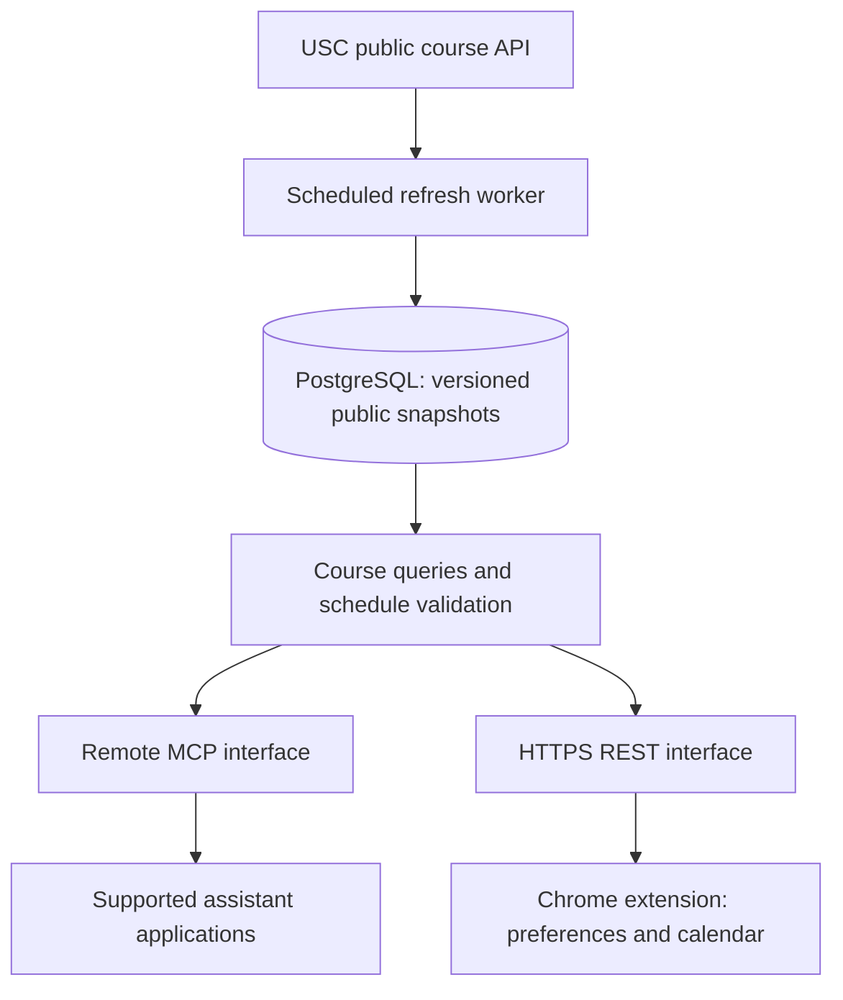

# System specification

## Objective and initial decisions

Provide accurate, timestamped USC semester data to students' existing AI assistants and a companion Chrome extension. Keep ingestion shared across users. Start with retrieval and schedule validation; add deterministic schedule generation later.

Proposed implementation baseline: TypeScript, a current stable Node.js runtime, the official MCP TypeScript SDK using a mutually supported Streamable HTTP version, PostgreSQL, and a Manifest V3 extension with a React calendar UI. Pin versions after checking current official documentation during implementation. One application exposes both MCP and REST interfaces over the same domain services. One separate worker process performs refreshes. These are proposed choices, not existing infrastructure.

## Responsibilities

| Component | Responsibility |
|---|---|
| USC source adapter | Fetch and parse public records; no student credentials or hidden endpoints |
| Refresh worker | Enumerate term programs, fetch with bounded concurrency, retry transient errors, stage and publish snapshots |
| Database | Preserve source records, normalized relationships, versions, freshness, and completeness |
| Domain service | Search, batch course retrieval, section retrieval, deterministic validation |
| MCP adapter | Expose bounded, structured tools to supported assistant hosts |
| REST adapter | Expose equivalent functionality to the extension |
| Assistant host | Interpret natural language, gather preferences, propose schedules, explain validated results |
| Extension | Course selection, local preference storage, calendar rendering, connector setup guidance and export |

## Source verified on September 6, 2026

Requests without cookies, login, or an API key succeeded against:

- `https://classes.usc.edu/api/Terms/Active`
- `https://classes.usc.edu/api/Programs/TermCode?termCode=20263`
- `https://classes.usc.edu/api/Courses/CoursesByTermSchoolProgram?termCode=20263&school=ENGV&program=CSCI`
- `https://classes.usc.edu/api/Courses/Course?termCode=20263&courseCode=CSCI-104`

Fall 2026 (`20263`) had 244 program index entries and 245 school/program combinations. All 245 were retrieved successfully, one after a timeout retry; 25 returned no courses. Responses contained 4,653 distinct published course codes and 9,537 distinct term/section IDs, including 98 cancelled sections. These are historical check results, not fixtures or current availability guarantees. No comparison with authenticated Web Registration was performed.

The course endpoint returned no courses for the tested term-only and term-plus-school requests. Enumerate actual school/program pairs from the source index. Deduplicate cross-listings without discarding aliases or relationships.

Public data includes courses, units, prerequisites where populated, section types, linking codes, meetings, instructors, enrollment counts, clearance flags and session identifiers. Actual classroom locations require sign-in in the public UI and are omitted from unauthenticated JSON. Some instructors and times are missing. Syllabus URL presence does not prove that a syllabus exists or is accessible. Professor reviews and student-specific eligibility are outside this dataset.

## Data model

- `terms`: term code, season, year, source state.
- `snapshots`: term, version, start/end fetch timestamps, publication timestamp, coverage, parser version, status.
- `programs` and `program_schools`: index entries and school associations.
- `courses`: source identity, published/scheduled course codes, descriptions, units, requirements and restriction structures.
- `course_aliases`: cross-listed names mapped to source identity; avoid assuming identical titles imply the same course.
- `sections`: keyed by term and source section ID within a snapshot; type, link code, cancellation, clearance, seats and source session identifiers.
- `meetings`: one-to-many meetings per section; days, local times, nullable dates/locations, timezone `America/Los_Angeles`.
- `instructors` and assignments: preserve supplied names; do not merge distinct people solely by name.
- `source_responses`: raw payload or object-storage pointer, endpoint, checked-at timestamp and content hash.

Index term/course codes and term/section IDs. Preserve raw requirement expressions and unknown values. Keep section identity separate from semester-specific versions. A source field that is null is not automatically an unrestricted requirement or a free time slot.

## Refresh and cache policy

Store snapshots durably; retention and refresh frequency are separate decisions. A two-week snapshot is useful as history but too stale to present as current active-semester availability.

Proposed starting targets, subject to permitted USC load and observed behavior:

| Data | Registration period | Otherwise |
|---|---|---|
| Full term reconciliation | Daily | Weekly for upcoming/active terms |
| Active section changes | Every few hours | Daily |
| Actively requested seat data | Request a targeted refresh after a configurable short freshness window, initially 5 minutes | On demand within the same upstream budget |
| Archived terms | Freeze a final snapshot | Manual or infrequent correction |

These are local polling targets, not source freshness guarantees. The same endpoint may return several categories together; do not duplicate upstream requests for each field. Start with a small global request budget and at most 2 concurrent source requests, configurable after measurement and access-policy review. Never poll the entire catalog every five minutes merely because seats have a shorter target.

Stage a full refresh separately. Validate schemas, term IDs, coverage, duplicate identities and unexpected drops before atomically publishing it. A timeout or malformed response must not erase the previous good snapshot. A successful empty program response is different from a failed fetch and should be checked for unexpected change. Preserve old records until a complete reconciliation establishes deletion or cancellation.

For targeted updates, create a new version/overlay with per-record timestamps and publish it atomically. Validation pins an immutable version, including any availability overlay. Full snapshots are fetched over an interval, not at one exact source instant.

Every response reports snapshot version, checked-at timestamps, staleness and completeness. Serve stale public data with explicit status when source refresh fails. Coalesce refresh requests by term and course/program: many users create one upstream job. All refresh triggers share a global queue and upstream budget; users cannot force unrestricted source requests.

## Bulk requests and scale

Normal tool calls query our database, not USC. Batch course lookups, paginate broad searches and cap payload size. Separate interactive reads from worker ingestion. Cache shared public query results by tool inputs and snapshot version; never put private schedules in a shared public cache.

Apply per-client quotas, global rate limits, request timeouts and maximum input lengths server-side. Expose structured retryable errors. Retry timeouts and transient server failures with bounded exponential backoff and jitter; honor Retry-After. Stop and surface authentication/access-policy failures rather than bypassing them.

Start with one backend deployment, PostgreSQL and a refresh worker using a database-backed job queue. Keep interactive handlers stateless where the chosen MCP SDK permits it. If sessions are used, design routing/shared session state before adding replicas. Add Redis or more instances only when latency and load measurements justify them.

Illustrative test workload: 10,000 users × 12 calls over an hour is approximately 33 calls/second on average. Test bursts as well; this is not a capacity claim. Verify that increasing users does not proportionally increase source requests. Measure p50/p95 latency, payload size, error rate, database queries, refresh age, coverage, queue depth and coalescing effectiveness.

## Scheduling correctness

The first release allows an assistant to propose section IDs and calls backend validation. The validator checks overlapping known meetings, missing data, cancelled sections, course coverage, unit accounting and user-defined time blocks. Required component/link-code semantics must be researched and verified before the validator claims completeness. A generic matching link code alone is not proof of registration validity.

Unknown times, incomplete component rules or unavailable eligibility produce `indeterminate` findings. Time compatibility never establishes student enrollment eligibility. Availability is a snapshot and reserves nothing. Handle date ranges, daylight saving, cross-listed duplicates and lecture/lab/quiz combinations explicitly. Add campus-travel constraints only when trustworthy location data becomes available.

Later, a bounded solver can produce top-ranked valid alternatives from hard constraints and soft preferences. Cap candidates, runtime and output count; describe optimality only when the algorithm establishes it. Explain infeasible combinations and ask before relaxing hard constraints.

## Extension and provider compatibility

The extension calls REST; supported assistant applications call remote MCP. Installing the extension does not install a system prompt or MCP connection in unrelated websites. Publish a tested host/version/plan matrix and setup guide. Do not promise universal AI compatibility.

For unsupported hosts, export a compact selected-course package with source timestamps for the student to attach manually; exported data cannot execute tools or refresh itself. Do not ship brittle automation that injects messages into every AI website in the first release.

An in-extension chat using provider APIs is a separate future product decision. It requires provider adapters, tool execution, key handling, rate limits and billing. Consumer chat subscriptions must not be assumed to grant API access. No provider API calls are necessary for the initial data/validation service.

Store student preferences locally in the extension initially. Public catalog access must not require USC credentials. If service authentication is needed for remote MCP abuse control, implement the selected MCP authorization specification with an identity provider and scoped access; never embed a shared secret in an extension. Backend validation, authorization and limits cannot depend on the model following a prompt.

## Evidence and unresolved decisions

- [USC Fall 2026 catalog](https://classes.usc.edu/term/20263/catalogue/school)
- [MCP remote server guidance](https://modelcontextprotocol.io/registry/remote-servers)
- [ChatGPT MCP setup](https://help.openai.com/en/articles/12584461-developer-mode-and-mcp-apps-in-chatgpt-beta)
- [Claude remote connectors](https://support.claude.com/en/articles/11175166-get-started-with-custom-connectors-using-remote-mcp)
- [DeepSeek API tool calling](https://api-docs.deepseek.com/guides/tool_calls/)
- [Chrome background worker lifecycle](https://developer.chrome.com/docs/extensions/develop/concepts/service-workers/lifecycle)

Before production: establish permitted source request volume/reuse, source update cadence, exact component linking semantics, supported host onboarding, hosting budget and account requirements. API support is not proof that a provider's consumer chat UI accepts custom connectors.
