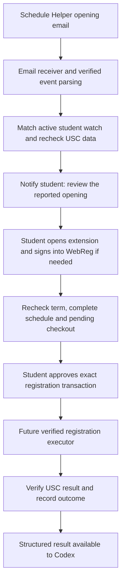

# USC Schedule Helper alert integration research

Researched September 6, 2026 (Pacific). Scope: source review and proposed architecture. No inbox was connected, forwarding rule created, notification subscription submitted, maintainer contacted, cron job installed or enrollment attempted.

## Assessment

USC Schedule Helper email alerts can be an input to a student-assisted registration workflow. They do not solve WebReg authentication, establish current seat availability or authorize enrollment. The recommended pilot uses narrowly filtered email forwarding into an event receiver, followed by a student notification, normal USC authentication and an exact registration review. A verified registration executor is separate work; the current extension implements coursebin preparation/addition, not checkout.

The existing native Codex companion exposes only the course tools and `present_schedule`. It has no mailbox listener or registration tool. Mail delivery and job recovery should run as ordinary backend code; the assistant receives a bounded event summary for explanation or replanning when available. Do not make an LLM invocation on every polling tick or assume that connecting an inbox in an unrelated assistant grants this application email access or an always-running process.

## Verified source behavior

The active repository is [jonluca/usc-class-notifier-api](https://github.com/jonluca/usc-class-notifier-api). Source inspection was pinned to commit `6c605c27b27ccd2affe9177e080ba52c9a101578`. The [Chrome Web Store listing](https://chromewebstore.google.com/detail/usc-schedule-helper/gchplemiinhmilinflepfpmjhmbfnlhk) advertises email/SMS availability notifications and warns that notification delivery is not guaranteed. Repository behavior is not a measured production latency or deployment-version guarantee.

| Finding                                                                                                                                                                                          | Integration implication                                                                                                                                                                                   |
| ------------------------------------------------------------------------------------------------------------------------------------------------------------------------------------------------ | --------------------------------------------------------------------------------------------------------------------------------------------------------------------------------------------------------- |
| The monitor schedules availability refreshes every five minutes with overrun prevention.                                                                                                         | Short openings can be missed; adding our own mailbox polling adds another delay. There is no instantaneous availability feed.                                                                             |
| The notifier checks USC public data, filters cancelled sections, and selects verified active watches whose notification cycle is unfinished.                                                     | An alert reports the notifier's observation, not personal enrollment eligibility or a reserved seat.                                                                                                      |
| Email sender in source is `USC Schedule Helper <schedule-helper@jonlu.ca>`.                                                                                                                      | Useful for a forwarding/filter rule, but a From header alone cannot authenticate an event. Actual delivered-message headers were not tested.                                                              |
| The subject and plain-text MIME body summarize seat count and course. The HTML body includes the USC section number but does not explicitly render the semester.                                 | Parse bounded HTML text when available; subject-only or metadata-only parsing is insufficient. Bind a candidate alert to an existing term-specific watch and student confirmation; do not guess its term. |
| A completed notification cycle is marked notified. Students must re-enable it for further alerts.                                                                                                | A failed enrollment does not automatically cause another Helper notification. The UI needs a re-enable reminder; do not silently follow email action links.                                               |
| Email dashboard/watch links include a Helper verification key; the watch link uses Helper's internal watch-record ID.                                                                            | These are sensitive Helper account links, not USC credentials; the link's watch ID is not the USC section number. Exclude links/keys from logs and assistant context.                                     |
| No documented partner webhook or extension-to-extension event interface was found in the reviewed source/configuration or repository code searches. `/api/refresh` only returns an enabled flag. | Do not build against a presumed public notification API or call that route as if it triggers a refresh. A direct integration needs maintainer cooperation.                                                |

Evidence: [monitor](https://github.com/jonluca/usc-class-notifier-api/blob/6c605c27b27ccd2affe9177e080ba52c9a101578/jobs/monitor.ts), [FAQ](https://github.com/jonluca/usc-class-notifier-api/blob/6c605c27b27ccd2affe9177e080ba52c9a101578/src/pages/faq/index.tsx), [notifier](https://github.com/jonluca/usc-class-notifier-api/blob/6c605c27b27ccd2affe9177e080ba52c9a101578/src/server/api/availabilityNotifications.ts), [delivery](https://github.com/jonluca/usc-class-notifier-api/blob/6c605c27b27ccd2affe9177e080ba52c9a101578/src/emails/utilities/sendEmail.ts), [subject construction](https://github.com/jonluca/usc-class-notifier-api/blob/6c605c27b27ccd2affe9177e080ba52c9a101578/src/emails/processors/spotsAvailableEmail.ts), [HTML template](https://github.com/jonluca/usc-class-notifier-api/blob/6c605c27b27ccd2affe9177e080ba52c9a101578/src/emails/SpotsAvailableEmail.tsx), [watch re-enablement](https://github.com/jonluca/usc-class-notifier-api/blob/6c605c27b27ccd2affe9177e080ba52c9a101578/src/server/api/routers/user.ts), [refresh route](https://github.com/jonluca/usc-class-notifier-api/blob/6c605c27b27ccd2affe9177e080ba52c9a101578/src/pages/api/refresh/index.ts).

## Receiving alerts

| Option                                                               | Advantages                                                                                           | Additional work / limits                                                                                                                                                                                                          |
| -------------------------------------------------------------------- | ---------------------------------------------------------------------------------------------------- | --------------------------------------------------------------------------------------------------------------------------------------------------------------------------------------------------------------------------------- |
| Forward only Helper alerts to an opaque, per-student inbound address | No access token for the student's entire mailbox; receives messages through an inbound email webhook | Student verifies a forwarding address and configures a narrow rule. Some managed accounts restrict forwarding. Retain only necessary extracted fields; forwarded mail can contain sensitive Helper links.                         |
| Gmail OAuth plus mailbox push notifications                          | Integrated mailbox onboarding; no regular whole-inbox scanning                                       | Reading message bodies uses a restricted scope. Google documents OAuth verification and security assessment requirements for server access to restricted data. A label filter limits processing, not the OAuth token's authority. |
| Microsoft Graph delegated mailbox notifications                      | Official Outlook message notifications                                                               | Read permission, tenant consent policy, subscription renewal and recovery must be handled. Body access is needed; metadata-only permission does not solve this template.                                                          |
| Maintainer-provided signed webhook                                   | Avoids email parsing and an extra mail hop                                                           | No supported webhook was found. Needs agreement, a documented contract, and reliable term/section/event identifiers.                                                                                                              |

For Gmail, push notifications carry a mailbox history ID rather than the email itself. The backend retrieves changes, deduplicates messages and fetches only relevant content. Watches expire and must be renewed at least every seven days; Google recommends daily renewal. Periodic history synchronization handles delayed or missed events. For Outlook, subscriptions similarly need renewal and lifecycle recovery. Cron is suitable for these maintenance tasks and bounded fallback polling, not for repeated AI inference.

Sources: [Gmail forwarding](https://support.google.com/mail/answer/10957), [Gmail push](https://developers.google.com/workspace/gmail/api/guides/push), [Gmail scopes](https://developers.google.com/workspace/gmail/api/auth/scopes), [Outlook notifications](https://learn.microsoft.com/en-us/graph/outlook-change-notifications-overview), [inbound email/webhook example](https://resend.com/docs/dashboard/receiving/introduction), [webhook verification example](https://resend.com/docs/webhooks/verify-webhooks-requests). Resend is an example of a supported receiving interface, not a purchased or selected deployment dependency.

## Proposed student workflow

1. The student subscribes to the desired sections through Helper and verifies its notification account. In our planner they create an active watch tied to an exact semester, course, section/component set and plan revision. This is new functionality; local planner preferences are not already synchronized to a cloud watch service.
2. The student enables narrowly filtered forwarding, or explicitly authorizes a supported mailbox integration. Use an opaque routing identifier instead of student identity in the address. An inbound provider event becomes a durable queued job only after signature verification and size/schema checks.
3. Application code extracts only course, section, reported seat count and event timing. It treats all email content as untrusted data, does not execute instructions or follow links, and does not send raw HTML/account links to Codex. Unknown templates, ambiguous terms, stale messages or unmatched watches stop at review.
4. Before prompting for USC sign-in, request a bounded refresh through our existing shared upstream budget. If seats are no longer reported, explain that and offer alternatives or a Helper re-enable reminder. This avoids unnecessary authentication prompts; public data remains a snapshot.
5. Notify the student with a review link bound to that student and watch. The student signs into USC on the real USC page, never by supplying a password in chat or by replying to an email. A local execution pilot resumes only when the browser/extension is available; a cloud alert receiver does not wake the laptop or move its session to a server.
6. Recheck again after authentication. The student reviews the exact term, required components, units, grade choices, schedule constraints and all pending checkout changes. Login is not itself approval to enroll. Use the current transaction approval or an explicitly designed, still-valid prior authorization; an alert is never that authorization.
7. A future registration executor performs only the approved transaction and verifies the authoritative result. Serialize actions per student, invalidate changed plans, journal before dispatch, and reconcile uncertain responses before any retry. Partial failure or an expired session stops the job. The current add-to-coursebin executor cannot perform this checkout step.
8. Provide a structured outcome to the assistant for explanation and replanning when connected. If the student missed the seat, Helper currently needs its watch re-enabled; automatic re-enablement would need a separately supported integration.

## Authentication and latency limits

The [authentication investigation](webreg-auth-feasibility.md) verified session-authenticated HTTP reads inside a browser. It did not verify standalone HTTP-client reuse, cloud session portability, expiration/renewal behavior or any registration submission. This proposed email workflow leaves those findings unchanged. A Helper dashboard key, mailbox OAuth token and USC session are three different credentials and are not interchangeable.

Waiting for the student to authenticate makes this an assisted registration flow. Total delay includes USC source publication, Helper's polling and processing, email delivery, our receiver/poller, the student's response, sign-in and USC's transaction processing. A one-minute mailbox poll adds a nominal zero-to-one-minute polling wait; retries or service delays can add more. Email arrival does not imply that a seat remains available, and a positive HTTP response does not prove enrollment.

[USC's registration guide](https://arr.usc.edu/web-registration/) states that checkout includes all classes marked Scheduled but Not Registered. Our executor must inspect the pending transaction rather than assuming that a single watched section is the only change.

## Dependency and pilot decision

Use an external-alert interface so forwarding, a future partner webhook and our own shared watcher can feed the same review flow. Keep our USC data backend for validation and current-data checks. Relying on Helper shifts monitoring work to another service; it does not eliminate its upstream delay or establish availability guarantees.

Before making Helper a dependency for a broad rollout, seek maintainer agreement on integration and load. GitHub reported no repository license, and the source-rendered [terms page](https://github.com/jonluca/usc-class-notifier-api/blob/6c605c27b27ccd2affe9177e080ba52c9a101578/src/pages/terms/index.tsx) contains reuse/commercial restrictions. Do not assume permission to copy or rehost the implementation. No legal conclusion about a student's personal forwarding rule is made here. No outreach was sent.

The smallest implementation milestone would receive a sanitized, term-bound test alert, deduplicate it, refresh the selected course and show a review/authentication prompt. Verify a real consented email sample and forwarding behavior before claiming compatibility. Mutation execution follows only after its authentication and checkout tests succeed. No production email integration, notification delivery timing, successful registration or cost/load benchmark was verified by this research.
